# Architecture Overview - Marengo Decor Project

## Project Structure Diagram

```mermaid
graph TD
    A[marengo-decor-fe-arch-lab] --> B[📁 src/]
    A --> C[📁 e2e/]
    A --> D[📁 public/]
    A --> E[📄 Config Files]
    
    %% Source Code Structure
    B --> B1[📁 app/]
    B --> B2[📁 components/]
    B --> B3[📁 data/]
    B --> B4[📁 lib/]
    
    %% App Router Structure
    B1 --> B1A[📁 api/]
    B1 --> B1B[📁 budget/]
    B1 --> B1C[📁 public/]
    B1 --> B1D[📄 layout.tsx]
    B1 --> B1E[📄 page.tsx]
    B1 --> B1F[📄 globals.css]
    
    B1A --> B1A1[📁 calculate/]
    B1A1 --> B1A1A[📄 route.ts]
    
    B1B --> B1B1[📁 budget/]
    B1B --> B1B2[📄 layout.tsx]
    B1B1 --> B1B1A[📄 page.tsx]
    
    B1C --> B1C1[📁 login/]
    B1C1 --> B1C1A[📄 page.tsx]
    
    %% Components Structure
    B2 --> B2A[📁 ui/]
    B2A --> B2A1[📄 button.tsx]
    B2A --> B2A2[📄 card.tsx]
    B2A --> B2A3[📄 input.tsx]
    B2A --> B2A4[📄 select.tsx]
    
    %% Data Layer
    B3 --> B3A[📄 materials.ts]
    
    %% Library Structure
    B4 --> B4A[📁 api/]
    B4 --> B4B[📁 hooks/]
    B4 --> B4C[📁 state/]
    B4 --> B4D[📁 types/]
    
    B4A --> B4A1[📄 react-query-provider.tsx]
    B4B --> B4B1[📄 useCalculateBudget.ts]
    B4C --> B4C1[📄 budgetStore.ts]
    B4D --> B4D1[📄 budget.ts]
    B4D --> B4D2[📄 material.ts]
    
    %% E2E Testing Structure
    C --> C1[📁 fixtures/]
    C --> C2[📁 page-objects/]
    C --> C3[📄 api-routes.spec.ts]
    C --> C4[📄 budget-flow.spec.ts]
    C --> C5[📄 login-flow.spec.ts]
    
    C1 --> C1A[📄 test-data.ts]
    C2 --> C2A[📄 budget-page.ts]
    C2 --> C2B[📄 login-page.ts]
    
    %% Public Assets
    D --> D1[📄 *.svg icons]
    
    %% Configuration Files
    E --> E1[📄 package.json]
    E --> E2[📄 tsconfig.json]
    E --> E3[📄 next.config.ts]
    E --> E4[📄 playwright.config.ts]
    E --> E5[📄 tailwind.config.js]
    E --> E6[📄 eslint.config.mjs]
    
    %% Styling
    classDef folder fill:#e1f5fe,stroke:#01579b,stroke-width:2px
    classDef file fill:#f3e5f5,stroke:#4a148c,stroke-width:1px
    classDef config fill:#fff3e0,stroke:#e65100,stroke-width:1px
    classDef test fill:#e8f5e8,stroke:#1b5e20,stroke-width:2px
    
    class A,B,C,D,B1,B2,B3,B4,B1A,B1B,B1C,B1A1,B1B1,B1C1,B2A,C1,C2,B4A,B4B,B4C,B4D folder
    class B1D,B1E,B1F,B1A1A,B1B2,B1B1A,B1C1A,B2A1,B2A2,B2A3,B2A4,B3A,B4A1,B4B1,B4C1,B4D1,B4D2,C1A,C2A,C2B,D1 file
    class E1,E2,E3,E4,E5,E6 config
    class C,C3,C4,C5 test
```

## Architectural Patterns

### Next.js App Router Flow

### State Management Architecture

### Testing Strategy

## Technology Stack

| **Layer** | **Technology** | **Responsibility** |
|-----------|----------------|--------------------|
| **Frontend** | React 19 + Next.js 16 | SSR, Client Components, Routing |
| **State Management** | Zustand + React Query | Client State + Server State |
| **Styling** | Tailwind CSS | Utility-first CSS |
| **API** | Next.js API Routes | Backend logic, Data processing |
| **Testing** | Playwright | E2E testing, User flows |
| **Type Safety** | TypeScript 5+ | Static type checking |
| **Build Tool** | pnpm | Package management |

## Key Features

- **App Router**: Modern Next.js 16 structure
- **Server/Client Separation**: Optimized components
- **State Management**: Zustand + React Query
- **Type Safety**: TypeScript throughout the project
- **Testing**: Playwright with Page Object Model
- **Modern CSS**: Tailwind CSS utility-first
- **API Routes**: Integrated Next.js backend

## Architecture Benefits

1. **Scalability**: Modular and well-organized structure
2. **Maintainability**: Clear separation of concerns
3. **Performance**: SSR + Next.js 16 optimizations
4. **Developer Experience**: TypeScript + modern tooling
5. **Quality Assurance**: Comprehensive E2E testing
6. **Industry Standards**: Modern development best practices